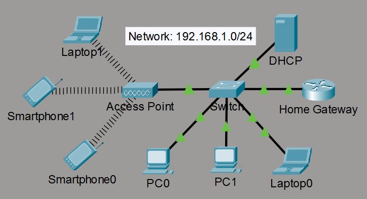
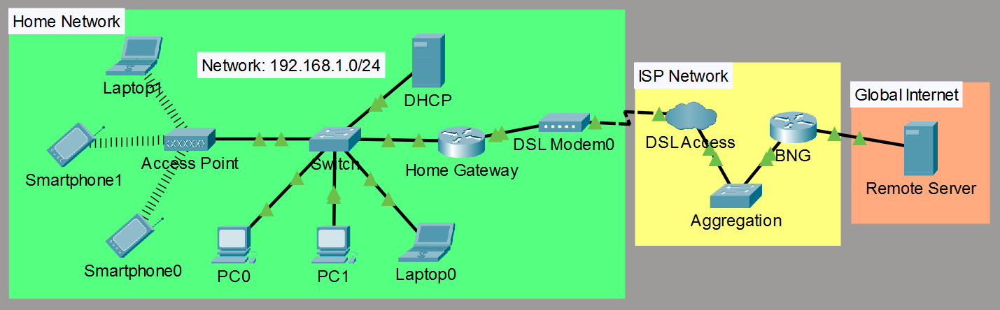
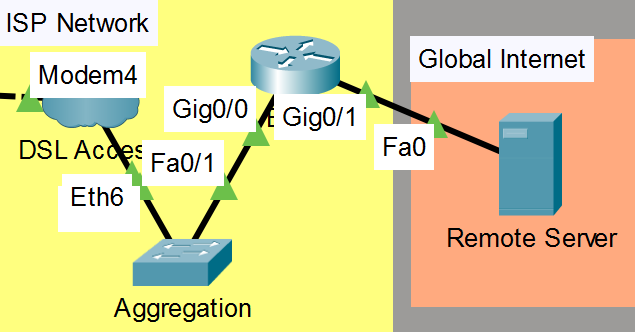
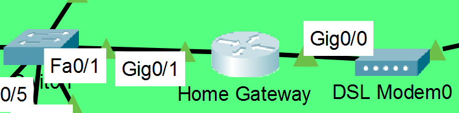

# PPPoE and ISP Networking

## The problem:

AN ISP delivering connectivity to thousands of homes needs to ensure that their services are only reachable to the paying customers.

PPPoE (PPP over Ethernet) makes that possible. 

PPPoE establishes the Ethernet link point-to-point session (Discovery Session, and PPP Session), over which PPP can work and provide the authentication functionality (CHAP or PAP).

---

## Final network topology

This lab begins from a standard home network



Then builds a simplified DSL broadband network around it, to imitate how actual ISPs deliver connectivity.

> Due to limitations of Packet Tracer, some advanced ISP devices like DSLAM or PON are abstracted away

#### With this simplified network we have:

**Home Gateway** 

VVV Ethernet VVV

**DSL Modem**

VVV Telephone copper VVV

**DSLAM** (in our case DSL access) (Many modem lines > single uplink) 

VVV Ethernet VVV

**Aggregation** (switches and routers combining DSLAM uplinks) 

VVV

**BNG** (also called **BRAS**) (basically a router and a PPPoE server) > 

VVV

**Internet Backbone**



---

## PPPoE server on the BNG



### Preparation

Give the BNG's customer-facing interface (g0/0) with an IP address:

```
BNG(config)#int g0/0
BNG(config-if)#ip address 210.18.100.1 255.255.255.224
BNG(config-if)#no shutdown
```

Create a local user for authentication:

```
BNG(config)#username client0 password unsafepass
```

Create a pool of IP addresses for PPPoE to hand out:

```
BNG(config)#ip local pool ISP-POOL 189.18.200.16 189.18.200.32
```

### Virtual-template

A virtual-template is a blueprint for configuring customer interfaces. It gets clonned for each established PPPoE session.

```
BNG(config)#interface virtual-template 1
```

It automatically configures the customer virtual-access interface with:

- An available IP from the address pool:

```
  BNG(config-if)#peer default ip address pool ISP-POOL
```

- The IP address clients use to reach BNG after a successful authentication. taken from G0/0 by setting it as unnumbered:

```
  BNG(config-if)#ip unnumbered g0/0
```

- The Authentication method:

```
  BNG(config-if)#ppp authentication chap
```

### BBA-group

bba-group stores the PPPoE connection preferences that get applied to customer-facing interfaces.

Create a group that uses our virtual-template 1 to define how to configure customer interfaces

```
BNG(config)#bba-group pppoe BBA-GROUP1
BNG(config-bba)#virtual-template 1
```

#### Assign the BBA-group to the interface facing the clients

```
BNG(config)#interface g0/0
BNG(config-if)#pppoe enable group BBA-GROUP1
```

Without this, g0/0 never accepts any PPPoE requests. see #troubleshooting Problem 2.

---

## PPPoE client on the Home Gateway



### Preparation

Configure interface facing the Modem to not have an IP

```
Home(config)#int g0/0
Home(config-if)#no ip address
Home(config-if)#no shutdown
```

And define for it to associate it with dialer pool 1. For the router to use the physical interface as transport for PPPoE

```
Home(config-if)#pppoe-client dial-pool-number 1
```

### Dialer

Dialer1 is the home gateway's actual PPP interface that reaches the BNG. it defines how the gateway should communicate with BNG

use the prepared interface g0/0 (already set to dial-pool-number 1) for transmissions:

```
Home(config)#int dialer1
Home(config-if)#dialer pool 1
```

Instead of setting the WAN IP manually. We ask BNG for it:

```
Home(config-if)#ip address negotiated
```

Set encapsulation to PPP:

```
Home(config-if)#encapsulation ppp
```

And the credentials to authenticate against BNG:

```
Home(config-if)#ppp chap hostname client0
Home(config-if)#ppp chap password unsafepass
```

Without this, the Home Gateway has nothing to authenticate with. see #troubleshooting, Problem 1.

And bring the interface up to start the PPPoE Discovery:

```
Home(config-if)#no shutdown
```

### Verify

Now the Home Gateway successfully authenticates and gets its IP address from the pool:

```
Home#show ip interface brief
Interface              IP-Address      OK? Method Status                Protocol 
GigabitEthernet0/0     unassigned      YES unset  up                    up 
GigabitEthernet0/1     192.168.1.1     YES manual up                    up 
Virtual-Access1        unassigned      YES unset  up                    up 
Dialer1                189.18.200.16   YES IPCP   up                    up 
```

### Default Gateway

Finally, we can set the home router to resolve all unknown networks to BNG via Dialer1 interface:

```
Home(config)#ip route 0.0.0.0 0.0.0.0 Dialer1
```

---

## Known limitation: NAT with a Dialer interface

Normally NAT would be configured with Dialer1 for inside hosts to reach the internet:

```
Home(config)#access-list 1 permit 192.168.1.0 0.0.0.255
Home(config)#ip nat inside source list 1 interface Dialer1 overload
```

Packet Tracer's NAT simulation doesn't support Dialer interfaces, though:

```
Home(config)#ip nat inside source list 1 interface ?
  Ethernet         IEEE 802.3
  FastEthernet     FastEthernet IEEE 802.3
  GigabitEthernet  GigabitEthernet IEEE 802.3z
  Serial           Serial
Home(config)#ip nat inside source list 1 interface dialer1 overload
                                                   ^
% Invalid input detected at '^' marker.
```

And`interface dialer1` does not accept `ip nat outside`:

```
Home(config)#int dialer1
Home(config-if)#ip nat outside
                   ^
% Invalid input detected at '^' marker.

Home(config-if)#ip nat ?
% Unrecognized command
```

And manually setting a NAT pool to the current address doesn't work either:

```
Home(config)#ip nat pool PPPOE-DIALER-POOL 189.18.200.16 189.18.200.16 netmask 255.255.255.255
Home(config)#ip nat inside source list 1 pool PPPOE-DIALER-POOL overload
```

Again, because Dialer doesn't support `ip nat outside` to make it eligible for NAT translations.

---

## Troubleshooting

When building the lab two mistakes prevented the Home Gateway from getting an IP. Above material already contains the fixes.

### Problem 1: Home Gateway never authenticates

**Symptom:** Dialer1 doesn't come up with an IP; PPP negotiation doesn't complete.

**Root cause:** Dialer1 didn't have the necessary CHAP credentials configured. And couldn't provide credentials to BNG when authenticating.

**Fix:** Provide the credentials

```
Home(config)#interface Dialer1
Home(config-if)#ppp chap hostname client0
Home(config-if)#ppp chap password unsafepass
```

### Problem 2: PPPoE session doesn't start

**Symptom:** `show pppoe session` showed no active sessions so PPPoE process couldn't even begin:

```
BNG#sh pppoe session
Uniq ID  PPPoE  RemMAC          Port                    VT  VA         State
           SID  LocMAC                                      VA - st    Type
```

**Root cause:** BNG's customer-facing interface didn't have the BBA group assigned.

**Fix:** Assign the BBA group to g0/0

```
BNG(config)#interface g0/0
BNG(config-if)#pppoe enable group BBA-GROUP1
```

**Verify:** Now we can see the session from our Home router

```
BNG#sh pppoe session 
     1 session in LOCALLY_TERMINATED (PTA) State
     1 total
Uniq ID  PPPoE  RemMAC          Port                    VT  VA         State
           SID  LocMAC                                      VA - st    Type
  1      1      0090.0CD7.1601  Gig0/0                  1   Vi2.1      PTA
                0060.5CE4.965A                              UP
```

And with both fixes the Home Gateway gets its IP address, as shown in Verify, above.

---

## Final verification

The Home router can successfully reach the BNG

```
Home#ping 210.18.100.1 
Sending 5, 100-byte ICMP Echos to 210.18.100.1, timeout is 2 seconds:
!!!!!
```

And though NAT isn't available (see Known limitation), as a temporary solution, we can provide BNG with a static route to the Home network. Which will provide the end hosts reachability to the remote server:

```
BNG(config)# ip route 192.168.1.0 255.255.255.0 189.18.200.16
```

The packets fallow the expected path: Gateway > BNG > remote server

```
C:\>tracert 103.5.17.50
  1   0 ms      0 ms      0 ms      192.168.1.1
  2   22 ms     22 ms     22 ms     210.18.100.1
  3   18 ms     18 ms     22 ms     103.5.17.50
```

---

## Wrap-up

This lab covered the PPPoE and it's most common usage of ISP customer authentication, on an imitated DSL Broadband network.

Along the way, two problems preventing authentication were encountered and documented in troubleshooting: 

1. Missing credentials on Home Gateway Dialer interface. 
2. BNG's customer-facing interface not assigned a BBA group.
